<div align="center">

# 🎯 One Point Interview AI

### An Intelligent Mock Interview Platform built for FAANG-level Engineering Prep.

[](https://main.d369q8sr84jlxa.amplifyapp.com/)
[](https://react.dev)
[](https://nodejs.org)
[](https://firebase.google.com)
[](#)

One Point Interview AI simulates real-world engineering interviews. Practice **Data Structures & Algorithms**, **System Design**, and **Low-Level Design** with an AI that does not just give you the answer. It pushes you to think, communicate, write code, and improve like a senior engineer.

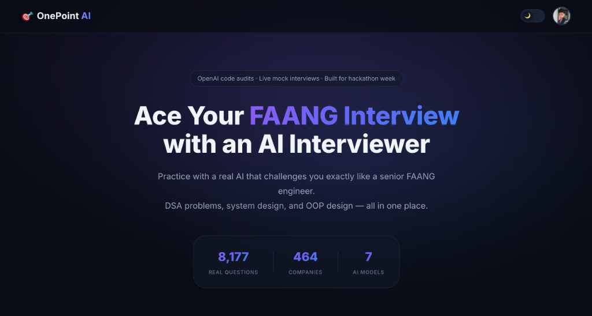

</div>

---

## 🌟 Why I Built This (For Interviewers & Engineers)

I built One Point Interview AI to solve a genuine problem in tech recruitment prep: static LeetCode grinding doesn't teach you how to communicate. In a real FAANG interview, the interviewer cares just as much about **clarifying questions**, **edge cases**, and **trade-offs** as they do about the final code. 

This platform bridges that gap by providing a **conversational, context-aware AI interviewer** with an advanced code audit workflow. It features global session persistence, structured complexity analysis, edge-case review, and guided hints so users can move between a DSA roadmap, dashboard, code editor, and active interview sessions without losing context.

---

## ✨ Key Technical Features

- 🧠 **Context-Aware Interview Engine**: Tailored prompts depending on the interview domain (DSA vs. System Design vs. LLD). The AI acts as an interviewer, dropping hints and asking follow-ups instead of just dumping code.
- 🧪 **Advanced Code Audit Mode**: Sends raw user-submitted code to the internal AI API and returns structured JSON with Big O complexity, bugs, logical vulnerabilities, missed edge cases, and progressive hints.
- 🔄 **Global Session Persistence**: Built a robust state-management system. Navigate away from an active interview, browse the interactive roadmap, and jump right back in. The session state and timers resume flawlessly.
- 🗺️ **NeetCode 150 Integration**: An interactive roadmap directly integrated into the platform. Users can pick a specific question and instantly launch a localized AI tutor session.
- 📊 **Automated Scorecards**: At the conclusion of a timed interview, a secondary LLM pipeline generates a markdown-based scorecard evaluating the user's communication, problem-solving speed, and code optimality.
- 💬 **Rich Markdown Chat**: Support for syntax-highlighted code blocks and Mermaid.js diagrams directly in the chat interface.

- 🏢 **Mock It: Full Company Interview Loop**: Simulate a complete 4-round FAANG onsite loop (2x DSA, 1x System Design, 1x Managerial). This mode strings together specialized LLM evaluator contexts to mimic a full grueling 4-hour onsite interview block.
- 🔐 **Secure Admin Portal**: Built-in role-based access control (RBAC) to manage users, monitor API limits, and track active sessions globally.

---

## 📸 Platform Walkthrough

### 1. Seamless Landing & Setup
Get started instantly from the landing page.
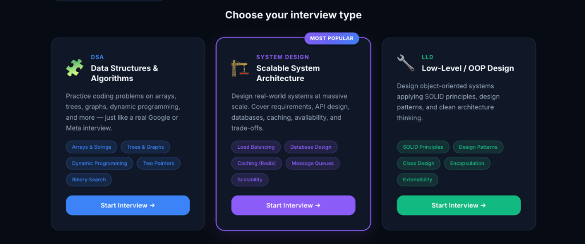

### 2. Learn & Practice Modes
If you're not ready for a timed interview, start an un-timed AI tutoring session to learn step-by-step.
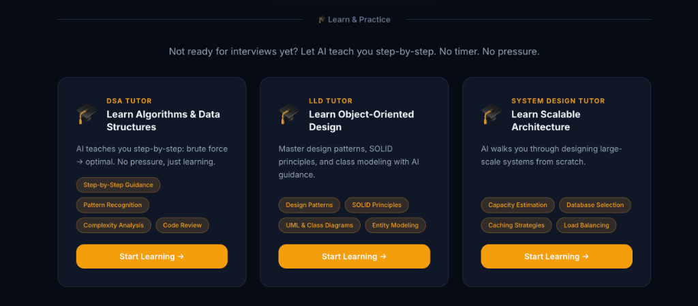

### 3. Configurable Interviews
Tailor your interview exactly how you want it—choose the target company, difficulty, and the AI evaluator model.
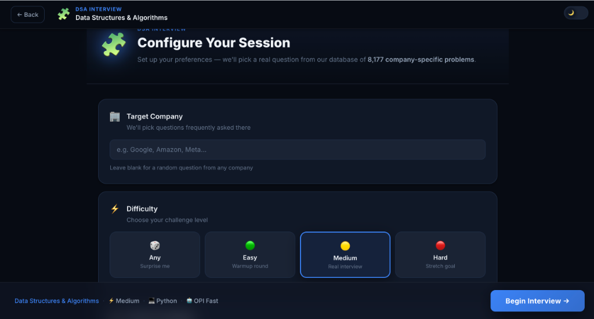

### 4. Specialized AI Models
We utilize heavily optimized, domain-specific AI models to drive the chat engine depending on your task.
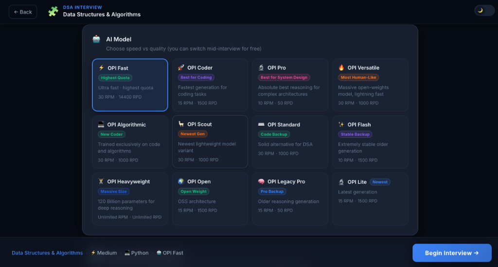
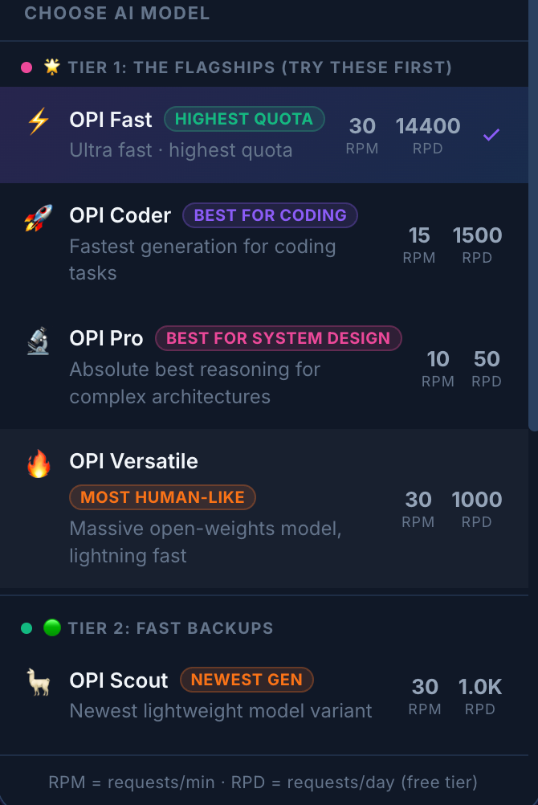

### 5. Active Interview Sessions
Your active sessions are completely synced. The interviewer adapts dynamically to your code submissions and asks intelligent follow-up questions.
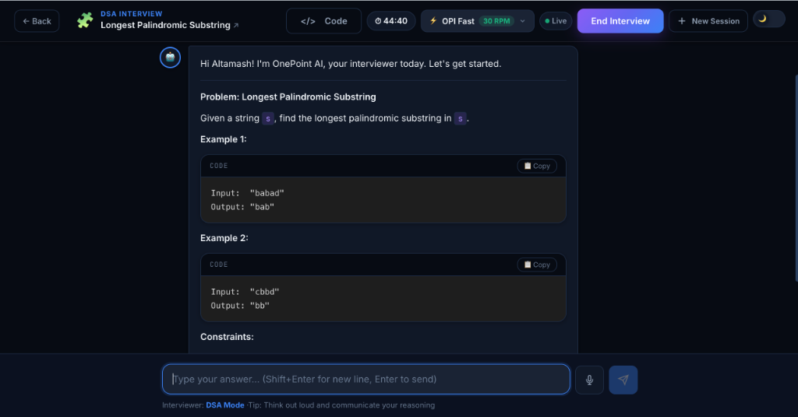
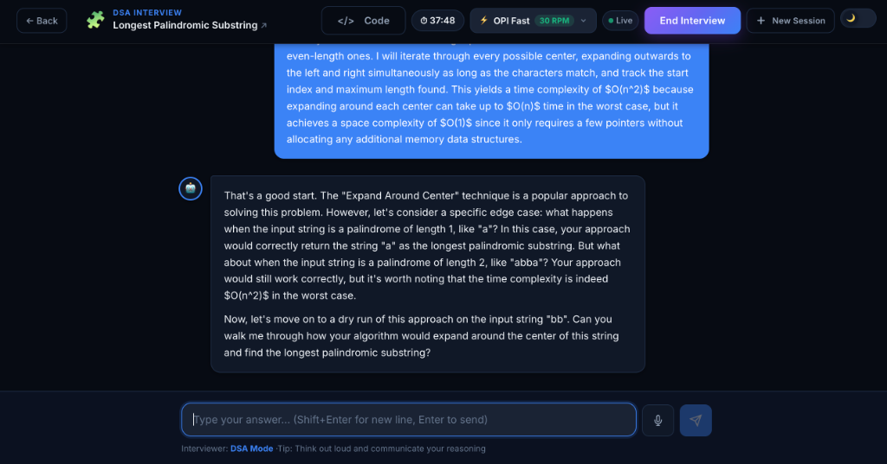

### 6. Detailed AI Scorecards
After finishing a timed session, get a detailed evaluation of your communication, complexity, and problem-solving skills with a final Hire/No-Hire verdict.
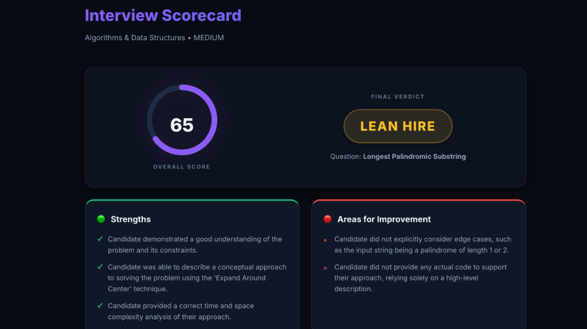

### 7. Comprehensive Interview History
Every session is securely saved. You can always review past interviews, scorecards, and AI feedback anytime, anywhere.
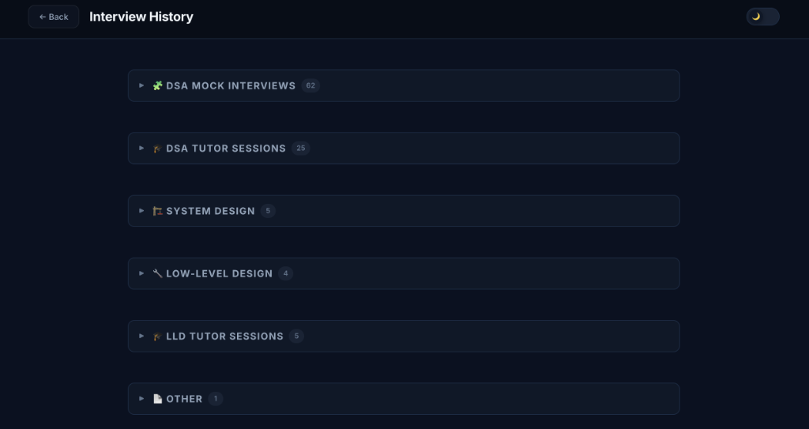

### 8. Interactive Roadmap
The roadmap dynamically tracks your progress. Check off questions as you solve them or start new AI tutor sessions for any problem.
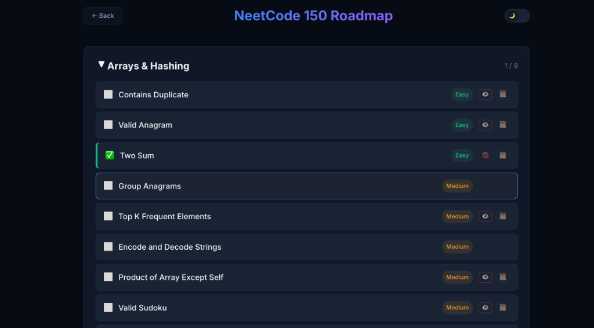

---

## 🛠️ Tech Stack & Architecture

This project is a full-stack JavaScript monolith designed for speed and state resilience.

| Layer | Technology | Purpose |
|-------|-----------|---------|
| **Frontend** | React 19, CSS3 | Component-driven UI, Context API for global state |
| **Backend** | Node.js, Express 5 | REST API, prompt orchestration, and LLM communication |
| **Authentication**| Firebase Auth | Secure Google/Email sign-in |
| **Database** | Cloud Firestore | NoSQL storage for user profiles and chat histories |
| **LLM Inference** | OPI AI | Structured code audits, interview responses, and scorecard generation |
| **Deployment** | AWS Amplify | High-availability global CDN hosting |

### System Flow
1. **Client** initiates a session via the React frontend.
2. **Express Backend** receives the request, constructs the domain-specific prompt, and forwards chat context to the selected model or raw code to the **Code Audit API**.
3. **Firestore** acts as the source of truth, continuously syncing chat history so users can securely access their past interviews from any device.

---

## 🚀 Run It Locally

### Prerequisites
- Node.js 18+
- Firebase project (Authentication & Firestore enabled)
- OPI Services API key
- OPI Backup API key
- Optional OPI Primary API key

### 1. Clone the repo
```bash
git clone https://github.com/AltamashAhmad/one-point-interview.git
cd one-point-interview
```

### 2. Setup Frontend
```bash
cd frontend
npm install

# Create .env file
cp .env.example .env
# Add your Firebase config keys
```

### 3. Setup Backend
```bash
cd ../backend
npm install

# Create .env file
echo "PORT=8080" > .env
echo "OPI_SERVICES_API_KEY=your_key_here" >> .env
echo "OPI_BACKUP_API_KEY=your_key_here" >> .env
echo "OPI_PRIMARY_API_KEY=your_key_here" >> .env

# ADD FIREBASE CREDENTIALS
# Download your Firebase Admin serviceAccountKey.json and place it in this backend directory!
```

### 4. Run Locally
```bash
# Terminal 1 — Backend
cd backend && npm start

# Terminal 2 — Frontend
cd frontend && npm start
```

Open **http://localhost:3000** 🎉

---

## 👨‍💻 About The Author

**Altamash Ahmad** — Full Stack Software Engineer passionate about building scalable, user-centric web applications and AI-driven platforms.

[](https://altamashportfolio-inky.vercel.app/)
[](https://github.com/AltamashAhmad)
[](https://www.linkedin.com/in/altamash9648/?skipRedirect=true)

---

<div align="center">
⭐ If you're an interviewer, recruiter, or engineer, feel free to try the live demo and reach out! ⭐
</div>
